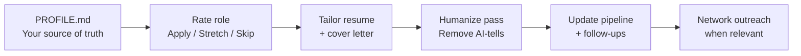

# AI-Assisted Job Search Operating System

[](LICENSE)
[](https://cursor.com)

> Turn your code editor into a structured job-search copilot — role rating, tailored resumes, pipeline tracking, and networking, all with **human in the loop**. Nothing leaves your machine until you approve it.

**No app. No SaaS. No API keys.** Just markdown files and AI agent skills that work in [Cursor](https://cursor.com) (or any AI-capable IDE).

---

## Why This Exists

Most job searches fail in the same places: scattered spreadsheets, generic resumes, AI-generated cover letters that sound like AI, and no system for follow-ups or networking.

This repo is a **local-first operating system** for running a search with discipline — without giving up control. The AI drafts and organizes; you decide what gets sent.

Built during a real career transition in May 2026. Operational within days. Immediately produced structured, evidence-backed applications and productive recruiter conversations.

---

## What You Get

| Capability | What it does |
|---|---|
| **Role rating** | Paste a JD → get an Apply / Stretch / Skip verdict with reasoning |
| **Resume tailoring** | Build a role-specific resume + cover letter from your source-of-truth profile |
| **Voice cleanup** | Strip AI-tells so documents sound like you, not a model |
| **Pipeline tracking** | Track every role from backlog → applied → interview → offer |
| **Network mapping** | Classify contacts and plan structured outreach |
| **Weekly reflection** | Career-coaching check-ins aligned to your motivators |

---

## How It Works



**Typical flow:** paste a job description → rate it → build a tailored resume → humanize it → track it. One conversation, end to end.

---

## Quick Start

```bash
git clone https://github.com/OriginalDopey/job-search-agent-skills.git
cd job-search-agent-skills
```

Open the folder in [Cursor](https://cursor.com), then:

1. **Paste your LinkedIn URL or resume** and say **"Set me up"** — the system generates `PROFILE.md` automatically
2. Confirm your profile, target comp, and any hard blockers
3. *(Optional)* Fill `tracker/Career-Motivators.md` — 20–30 min, anchors your search direction
4. Paste a job description and say **"Rate this role for me"**

That's it. You're running.

→ Full walkthrough: [`START-HERE.md`](START-HERE.md)

---

## Skills Reference

The `skills/` folder contains behavioral specs any AI model can follow. In Cursor, just ask naturally:

| Say this… | Skill | Result |
|---|---|---|
| "Set me up" + LinkedIn or resume | `quick-setup` | Generates your `PROFILE.md` |
| "Rate this role" + JD | `role-fit-rater` | Apply / Stretch / Skip table |
| "Build me a resume for this" | `tailored-resume-builder` | Tailored resume + cover letter |
| "Humanize this" | `humanize-pass` | Strips AI-tells, matches your voice |
| "Update my pipeline" | `job-tracker` | Updates tracker + surfaces follow-ups |
| "Who should I reach out to?" | `network-mapper` | Contact classification + outreach plan |

Skills chain automatically — rate → build → humanize → track — without you managing the handoffs.

---

## Repo Structure

```
START-HERE.md                   ← setup walkthrough (start here)
PROFILE.md                      ← YOUR source of truth (created on setup)
RESUME-FORMAT-RULES.md          ← resume formatting standards
LINKEDIN-UPDATE-PLAYBOOK.md     ← step-by-step profile refresh

skills/                         ← AI agent behavioral specs
  SKILL.md                      ← index + operating principles
  quick-setup.md                ← onboarding from LinkedIn/resume
  role-fit-rater.md             ← Apply / Stretch / Skip rating
  tailored-resume-builder.md    ← resume + cover letter builder
  humanize-pass.md              ← AI-tell removal + voice rules
  job-tracker.md                ← pipeline tracking
  network-mapper.md             ← contact classification + outreach

tracker/                        ← your data lives here
  Applications.md               ← source of truth for all roles
  Pipeline.md                   ← status-grouped view
  Weekly-Review.md              ← Friday cadence template
  Career-Motivators.md          ← motivators worksheet
  Career-Story-Timeline.md      ← career timeline worksheet
  Network.md                    ← contact map

frameworks/                     ← methodology reference
  Career-Coaching-Reference.md  ← 4 frameworks explained

resumes/                        ← your resumes live here
  00-Resume-Template.md         ← blank scaffold
  09-Cover-Letter-Templates.md  ← append letters here
```

---

## Design Principles

**Human in the loop.** Every resume, cover letter, DM, and application needs your eyes and your send. The system gets you ~90% there — the last 10% is judgment, voice, and accuracy.

**Evidence-backed.** The system refuses to invent metrics. Every number in every resume bullet must trace to `PROFILE.md`. If a claim isn't sourced, the AI stops and asks you to confirm.

**Honest about gaps.** When a role is a stretch — missing cert, comp is low, domain is adjacent — the cover letter discloses it openly. Recruiters trust honesty.

**Local-first.** Your profile, applications, and network data stay in markdown files on your machine. No accounts, no cloud sync, no vendor lock-in.

---

## Requirements

| Tool | Required? | Purpose |
|---|---|---|
| [Cursor](https://cursor.com) or AI-capable IDE | Recommended | Runs the agent skills |
| Any capable AI model (Claude, GPT, etc.) | Yes | Powers the skills |
| [Pandoc](https://pandoc.org/) | Optional | `.md` → `.docx` conversion |
| Python 3 + `python-docx` | Optional | Formatted resume builds |

---

## Who This Is For

- **Job seekers** who want structure without another subscription app
- **Career changers** who need honest gap assessment and tailored positioning
- **Developers** who already live in an AI IDE and want their search to match that workflow
- **Anyone** tired of generic AI cover letters that recruiters can spot instantly

---

## Contributing

Found a bug? Have an improvement? PRs welcome.

The system is intentionally simple — markdown files and behavioral specs. No dependencies, no build step, no framework.

---

## About the Author

Built by **[Dave Richards](https://linkedin.com/in/dave--a--richards)** — product-minded engineer who treats a job search like a system design problem: clear inputs, honest outputs, human approval gates, and a audit trail.

If this repo is useful, connect on LinkedIn or ⭐ star the repo.

---

## Support

If this system saved you hours of resume-tailoring pain or helped you land interviews:

[](https://buymeacoffee.com/originaldopey)

---

## License

MIT — use it, fork it, share it, adapt it. If it helps you land your next role, that's the point.
